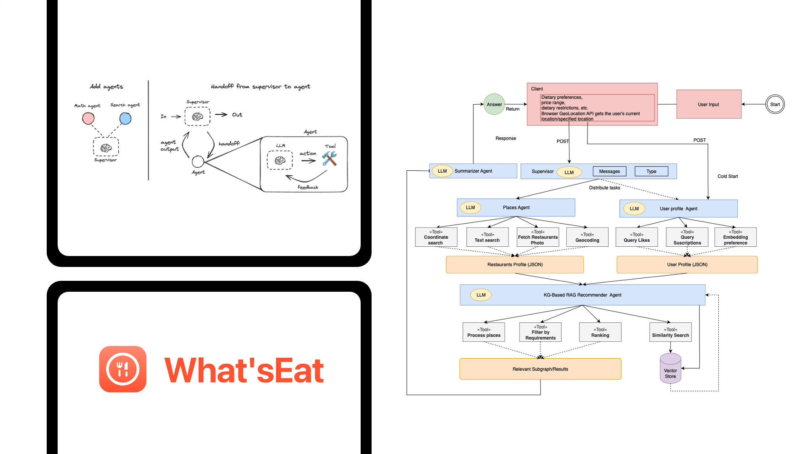
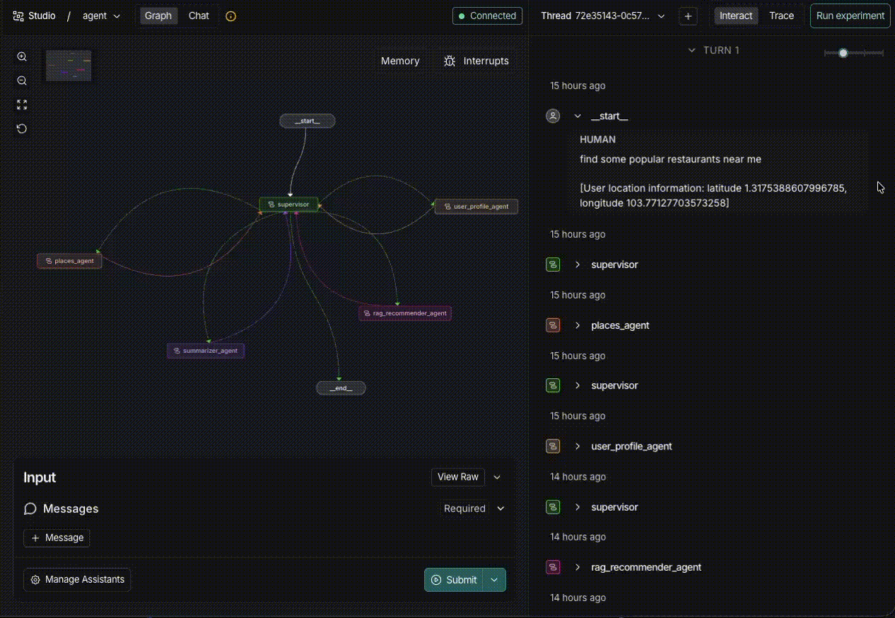
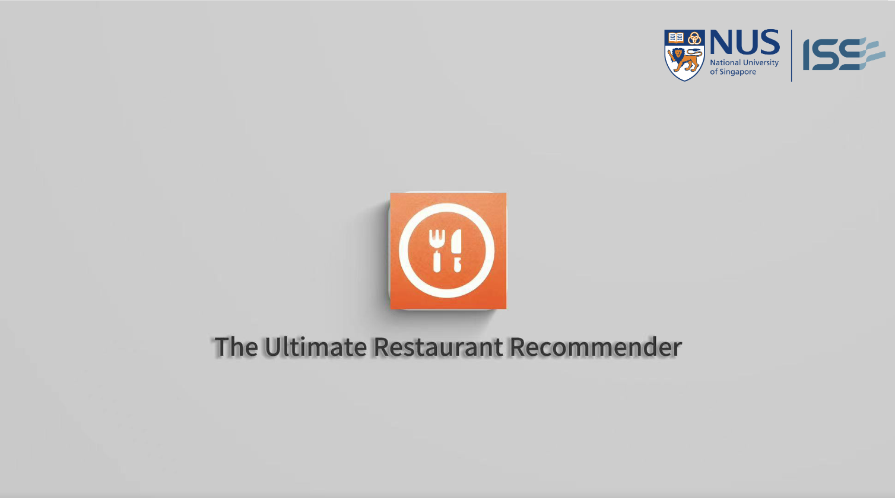
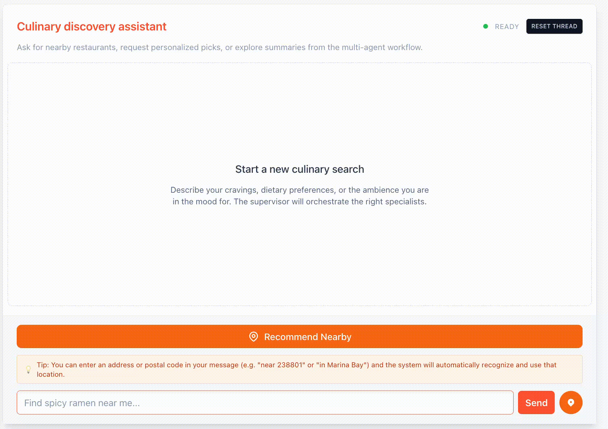
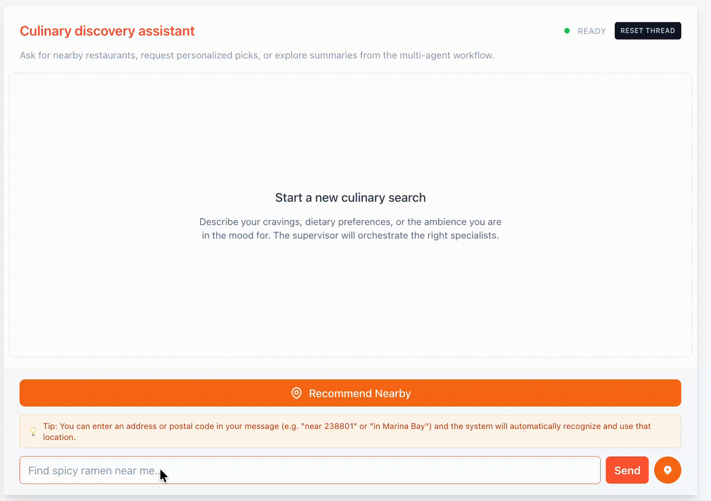
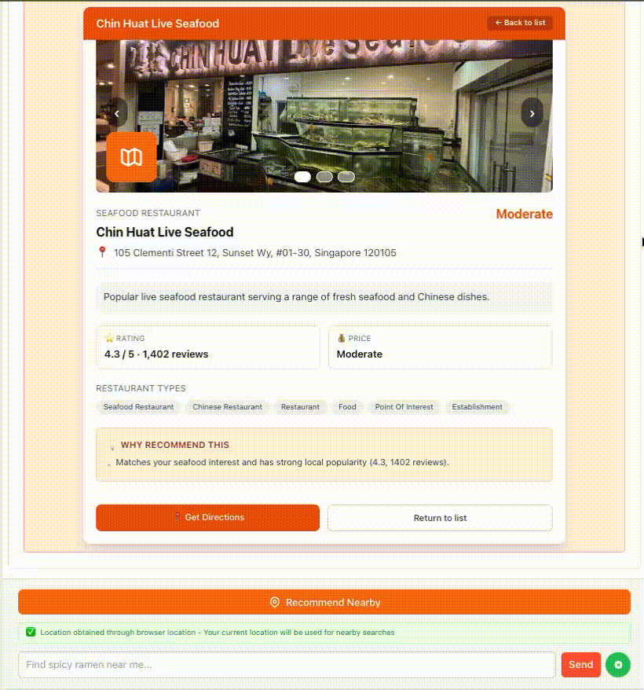

### [ Practice Module ] PRACTICE MODULE BRIEFING for Certificate in Intelligent Reasoning Systems (IRS)

**[ Naming Convention ]** IRS-PM-2025-08-30-AIS11FT-GRP-NeverStopCoding-WhatsEat

## SECTION 1 : PROJECT TITLE
### WhatsEat - Multi-agent Powered Restaurant Recommendation Assistant



<p align="center">
  <em>An intelligent multi-agent system that delivers personalized restaurant recommendations by conversational UI</em>
</p>

### Tech-Stack

<p align="left">
  <em>Frontend </em>
</p>
<p align="left" style="display:flex; gap:20px; flex-wrap:wrap; align-items:center;">
  <a href="https://reactjs.org/" target="_blank"></a>
  <a href="https://www.typescriptlang.org/" target="_blank"></a>
</p>


<p align="left">
  <em>Backend</em>
</p>
<p align="left" style="display:flex;gap:20px;flex-wrap:wrap;align-items:center;">
  <a href="https://openai.com/" target="_blank"></a>
  <a href="https://www.langgraph.com/" target="_blank"></a>
  <a href="https://www.langsmith.com/" target="_blank"></a>
  <a href="https://www.langchain.com/" target="_blank"></a>
  <a href="https://neo4j.com/" target="_blank"></a>
  <a href="https://pinecone.io/" target="_blank"></a>
  <a href="https://www.python.org/" target="_blank"></a>
  <a href="https://maps.google.com/" target="_blank"></a>
  <a href="https://www.youtube.com/" target="_blank"></a>
</p>

---

## SECTION 2 : EXECUTIVE SUMMARY / PAPER ABSTRACT

Amid a shift from static “nearby + rating” lists to context-aware personalization, Whats'Eat presents an explainable, multi-agent restaurant recommendation system. Built on a Supervisor–Agents graph using *LangGraph*, the system concurrently orchestrates an Places Agent and a User Profile Agent (both idempotent) to gather geographic evidence and lightweight behavioral signals. A KG-based RAG Recommender Agent then fuses a *Neo4j* knowledge graph with *Pinecone* vector retrieval for candidate recall and multi-factor ranking, and a Summarizer Agent produces a UI-ready {cards, rationale} JSON payload. Engineering contributions include contract-first JSON flows, idempotent tool calls with retries, field-masked API usage, pagination-stable ingestion, and a React frontend for map/route and card rendering. Functional tests cover places, profile, RAG, and summarization paths; in real use cases the system improves preference fit and explanation clarity over non-retrieval conversational baselines. This work contributes: 

- **A parallel-yet-controlled multi-agent orchestration pattern**
- **An evidence that hybrid KG + vector retrieval is effective for local-services recommendations**
- **A strict output contract with reproducible implementation details, providing a foundation for broader local-service scenarios.**

​		


<p align="center">
   
</p>

<p align="center">
  <em>LangGraph-Supervisor Multi-agent Monitoring</em>
</p>

---

## SECTION 3 : CREDITS / PROJECT CONTRIBUTION

| Name         | Email              | Phone    | Student ID |
| ------------ | ------------------ | -------- | ---------- |
| Ke Liwen     | e1553817@u.nus.edu | 80840573 | A0329490X  |
| Shang Jiakun | e1553372@u.nus.edu | 86696094 | A0329045E  |
| Liu Jiajia   | e1553327@u.nus.edu | 80387717 | A0329000X  |
| Yu Guotao    | e1554269@u.nus.edu | 94458679 | A0329942U  |
| Yan Huaju    | e1553823@u.nus.edu | 89415266 | A0329496L  |

## SECTION 4 : VIDEO OF SYSTEM MODELLING & USE CASE DEMO

[](https://www.youtube.com/watch?v=kfHtMgUZ3Eo)

Video Link (YouTube): *https://www.youtube.com/watch?v=kfHtMgUZ3Eo*

---

## SECTION 5 : USER GUIDE

### 5.1 Prerequisites & Installation

#### System Requirements
- **Browser**: Chrome, Firefox, Safari, or Edge (latest versions)
- **Internet Connection**: Required for real-time restaurant recommendations
- **Location Services**: Enable location permissions for current location features
- **API Keys**: 
  - OpenAI API key (for LLM-powered recommendations)
  - Google Maps API key (for maps and place search)
  - Pinecone API key (for vector similarity search)
  - Neo4j credentials (for knowledge graph queries)

#### Backend Setup
1. Navigate to the backend directory:
   ```bash
   cd WhatsEat-backend-LangGraph-supervisor-py
   ```

2. Create a Python virtual environment:
   ```bash
   python -m venv venv
   source venv/bin/activate  # On Windows: venv\Scripts\activate
   ```

3. Install dependencies:
   ```bash
   pip install -r requirements.txt
   ```

4. Set up environment variables:
   ```bash
   cp .env.example .env
   # Edit .env and add your API keys:
   # OPENAI_API_KEY=your_key
   # GOOGLE_MAPS_API_KEY=your_key
   # PINECONE_API_KEY=your_key
   # NEO4J_URI=your_uri
   # NEO4J_USERNAME=your_username
   # NEO4J_PASSWORD=your_password
   ```

5. Start the backend server:
   ```bash
   python main.py
   ```
   The server will run on `http://localhost:8000`

#### Frontend Setup
1. Navigate to the frontend directory:
   ```bash
   cd What2Eat-frontend-agent-chat-ui
   ```

2. Install dependencies:
   ```bash
   pnpm install
   ```

3. Create a `.env` file with:
   ```bash
   REACT_APP_API_URL=http://localhost:8000
   REACT_APP_GOOGLE_MAPS_KEY=your_key
   ```

4. Start the development server:
   ```bash
   pnpm start
   ```
   The frontend will open at `http://localhost:3000`

---

### 5.2 Getting Started with WhatsEat

#### Step 1: Launch the Application
- Open your browser and navigate to `http://localhost:3000`
- Allow location permissions when prompted (optional, but recommended for better recommendations)
- The home interface will display with a conversational chat panel

#### Step 2: Choose Your Location Method
WhatsEat offers two flexible ways to find restaurants:

**Option A: Use Current Location**
- Click the **"Use Current Location"** button
- Grant browser location access if not already enabled
- The system will automatically detect your coordinates

**Option B: Specify a Custom Location**
- Simply input a location you desired along with your request.
- You can enter a street address, landmark, or area name (e.g., "Marina Bay", "Tanjong Pagar", "Orchard Road")
- The map will update to show the selected area

<p align="center">
  
  
</p>

<p align="center">
  <em>Using Current Location (Left) & Searching by Specific Location (Right)</em>
</p>

---

### 5.3 Interacting with the Recommendation System

#### Step 3: Describe Your Preferences
- In the **chat input field**, describe what you're looking for:
  - *"I want Asian fusion food near the office"*
  - *"Looking for a quiet café with good WiFi"*
  - *"Fine dining experience for a special occasion"*
  - *"Halal restaurants with good reviews"*
  - *"Budget-friendly hawker centers"*

- You can mention:
  - **Cuisine types**: Chinese, Italian, Japanese, Thai, etc.
  - **Dietary preferences**: Vegetarian, vegan, halal, kosher
  - **Atmosphere**: Casual, fine dining, family-friendly, romantic
  - **Budget**: Cheap, moderate, expensive
  - **Special requirements**: WiFi, outdoor seating, parking, delivery
  - **Ratings/Reviews**: Quality expectations

#### Step 4: System Processing
The multi-agent system orchestrates four concurrent agents:

1. **Places Agent**: Searches nearby restaurants using Google Maps API
2. **User Profile Agent**: Builds a profile from your preferences and chat history
3. **RAG Recommender Agent**: 
   - Queries Neo4j knowledge graph for restaurant attributes
   - Performs Pinecone vector similarity search for semantic matching
   - Ranks candidates using multi-factor scoring
4. **Summarizer Agent**: Generates AI-powered explanations for each recommendation

#### Step 5: Review Restaurant Recommendations
The system returns personalized recommendations as **interactive cards** displaying:
- **Restaurant Name & Cuisine**: Quick identification
- **Rating & Review Count**: Social proof
- **Distance & Travel Time**: From your location
- **Why It Matches**: AI-generated explanation tailored to your request
- **Address & Contact**: Location details
- **Action Buttons**:
  - 🔗 **View Details**: Opens full restaurant profile
  - ⭐ **Directions**: Launches navigation
  - 🗺️ **Map**: Showing the street view and distance

<p align="center">
  
  
</p>

<p align="center">
  <em>Restaurant Cards with AI Explanations (Left) & Interactive Map View (Right)</em>
</p>

---

### 5.4 Interactive Map Features

#### Exploring on the Map
- **Restaurant Pins**: Each marker represents a recommended restaurant
- **Hover Information**: Shows restaurant name and rating on hover
- **Click to Select**: Click any marker to highlight and view details in the card panel
- **Map Controls**:
  - **Zoom In/Out**: Use mouse wheel or zoom buttons
  - **Pan**: Drag to explore nearby areas
  - **Your Location Pin**: Blue dot indicates your current/selected location

#### Route Visualization
- Click the **"Directions"** button on any card to see:
  - Optimized route from your location to the restaurant
  - Estimated travel time and distance
  - Multiple route options (if available)

---

### 5.5 Advanced Features

#### Refine Your Search
- **Follow-up Questions**: Continue the conversation to refine recommendations
  - *"Show me options with outdoor seating"*
  - *"Any vegetarian options from the previous list?"*
  - *"What about places closer to me?"*

#### Multi-Criteria Filtering (In-Chat)
The system understands contextual constraints:
- Price range: *"under SGD 20 per person"*
- Distance: *"within 2km"*
- Ratings: *"above 4 stars"*
- Opening hours: *"open until 11pm"*
- Parking: *"with parking available"*

#### Conversation History
- Chat messages are preserved during your session
- System learns from your preferences over time
- Previous selections inform future recommendations

---

### 5.6 Tips for Better Recommendations

1. **Be Specific**: Rather than "I want to eat", try "I'm craving spicy Thai food in a group-friendly environment"
2. **Mention Context**: Include occasion details - "Quick lunch during work break" vs "Romantic dinner date"
3. **Use Follow-ups**: Start broad, then refine: Ask general questions first, then request specific cuisines or amenities
4. **Check Ratings**: Pay attention to review counts and ratings displayed on cards
5. **Review the Explanation**: Read the AI-generated rationale to understand why a restaurant was recommended
6. **Trust the Map**: Verify distances and routes on the interactive map before committing

---

### 5.7 Troubleshooting

| Issue | Solution |
|-------|----------|
| **Location not detected** | Enable location permissions in browser settings → Privacy & Security |
| **No results appearing** | Try broadening your criteria or checking internet connection |
| **Map not loading** | Verify Google Maps API key is correctly configured in `.env` |
| **Slow recommendations** | Clear browser cache or wait for backend services (Neo4j, Pinecone) to stabilize |
| **Chat not responding** | Check backend server is running on `localhost:8000` and OpenAI API key is valid |
| **Restaurant details missing** | Indicates data gap in knowledge graph; try different search criteria |

---

### 5.8 System Architecture Overview (For Reference)

The WhatsEat system uses a **LangGraph Supervisor** pattern:

```
User Input
    ↓
Supervisor Agent
    ├─→ Places Agent (parallel) → Google Maps API
    ├─→ User Profile Agent (parallel) → Preference Analysis
    ├─→ RAG Recommender Agent → Neo4j + Pinecone
    └─→ Summarizer Agent → AI Explanation
    ↓
Frontend Rendering (React + TypeScript)
```

This design ensures:
- ✅ Parallel evidence gathering for faster responses
- ✅ Explainable recommendations with rationale
- ✅ Knowledge graph + vector search fusion for accuracy
- ✅ Idempotent operations with automatic retries

---

### 5.9 Example Use Cases

#### Use Case 1: Quick Weekday Lunch
```
User: "I need lunch within 10 minutes of my office in CBD, budget friendly"
System Output: 3-5 hawker centers and fast-casual restaurants within walking distance
Explanation: "These spots offer quick service, affordable pricing, and are within your time constraint"
```

#### Use Case 2: Special Occasion Dinner
```
User: "Fine dining Japanese experience for anniversary, romantic ambiance, around SGD 100 per person"
System Output: Premium omakase bars and upscale Japanese restaurants
Explanation: "Selected for authentic cuisine, intimate settings, and alignment with your budget"
```

#### Use Case 3: Family Outing
```
User: "Family-friendly restaurant with kids menu, good reviews, parking available"
System Output: Casual dining chains and food courts with ample parking
Explanation: "These venues cater to families with diverse menu options and convenient facilities"
```


---
## SECTION 6 : PROJECT REPORT / PAPER

`Refer to project report at Github Folder: ProjectReport`

**Recommended Sections for Project Report / Paper:**

- Executive Summary / Paper Abstract
- Business Problem Background
- Market Research
- Project Objectives & Success Measurements
- Project Solution (To detail domain modelling & system design.)
- Project Implementation (To detail system development & testing approach.)
- Project Performance & Validation (To prove project objectives are met.)
- Project Conclusions: Findings & Recommendation
- Appendix of report: Project Proposal
- Appendix of report: Mapped System Functionalities against knowledge, techniques and skills of modular courses: MR, RS, CGS
- Appendix of report: Installation and User Guide
- Appendix of report: 1-2 pages individual project report per project member, including: Individual reflection of project journey: (1) personal contribution to group project (2) what learnt is most useful for you (3) how you can apply the knowledge and skills in other situations or your workplaces
- Appendix of report: List of Abbreviations (if applicable)
- Appendix of report: References (if applicable)

---
## SECTION 7 : MISCELLANEOUS

`Refer to Github Folder: Miscellaneous`

